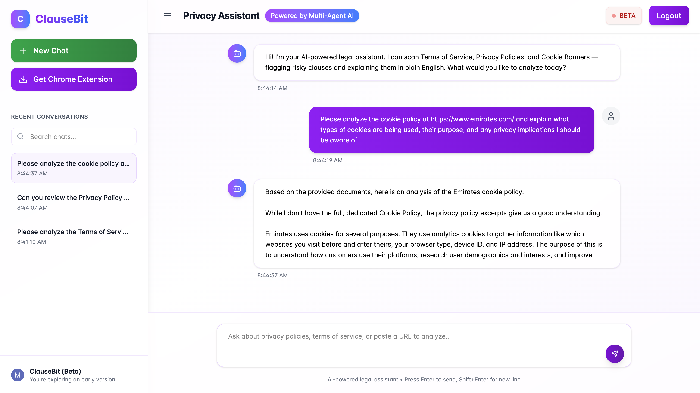
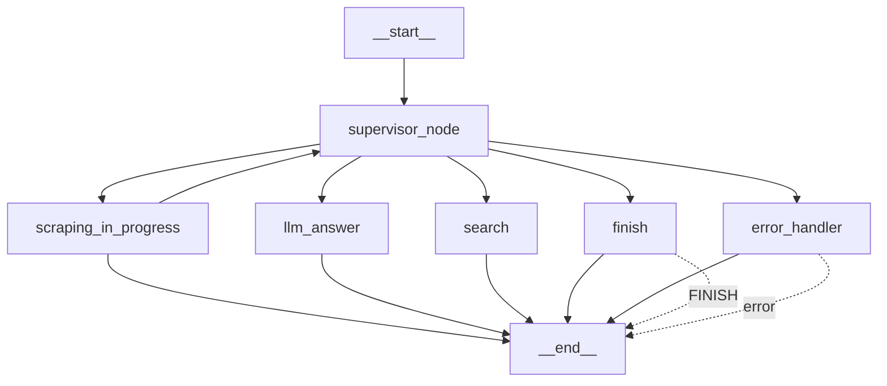

# ClauseBit 

**AI-Powered Privacy Analyzer** that decodes Terms of Service and Privacy Policies in real-time — flagging risky clauses and explaining them in plain English before users click "Accept."

---

## 🎯 The Problem

Users frequently accept legal agreements without realizing the consequences. Most don't read privacy policies or terms because they are:

- Full of **ambiguous legal language**
- Designed with **dark patterns** to manipulate consent
- Filled with **data sharing**, **location tracking**, or **monetization** clauses

ClauseBit brings transparency to these documents with AI — in real time.

---

## ✨ Key Features

### 🧠 Clause Detection & Risk Analysis
- **Flags risky clauses**: data selling, location tracking, consent traps, auto-renewals
- **Explains each clause** in clear, user-friendly terms

### 💬 ClauseBot – Chat Assistant
Ask plain-English questions like:
- *"Does this company sell my data?"*
- *"What happens if I delete my account?"*
- *"Are there hidden fees or auto-renewals?"*

Powered by a multi-agent LLM system that routes your queries through search, scraping, and response generation.

### 🌐 Browser Extension + Web App

- 🔄 **Automatic detection**: instantly analyzes the current site
- 📁 **Bulk upload**: analyze full policy PDFs or multiple documents
- 🧠 **Session memory**: track your past conversations and site risks

---

## 🏗️ Architecture Overview

### 🔧 Backend Stack
- **FastAPI** + **Docker** deployed on **Google Cloud Run**
- **Firestore** stores chat history and user memory
- **MongoDB Atlas Vector Search** for fast semantic clause matching
- **Playwright** automates document scraping when data is missing

### 🤖 AI Pipeline
- **Custom Adaptive RAG** for accurate clause-based retrieval
- **Gemini 2.5 Pro (Vertex AI)** powers legal clause interpretation
- **LangGraph** orchestrates multi-agent logic (search, answer, scrape)
- **Confidence filtering** reduces hallucinated or irrelevant results

### 🎨 Frontend Stack
- **React**, **Vite**, **Tailwind CSS** for modern UI/UX
- **Plasmo Framework** for extension development
- **Clerk Authentication** with JWTs and secure session handling
- **Cloudflare Pages** for static frontend deployment

---

## 📊 Performance Snapshot

| Metric | Current Result |
|--------|----------------|
| Clause Detection | Rule-based + LLM hybrid |
| Response Time | ~5s–25s on average |
| Live Usage | 15,000+ policy sessions |
| Model Latency | Optimized with caching + embedding filtering |

> ⚠️ *Accuracy claims are no longer overstated. Evaluation is ongoing using real-world policy test cases.*

---

## 🧠 LangGraph Multi-Agent Flow

* **Supervisor Node**: routes queries based on LLM or keyword signals
* **Search Node**: finds relevant clauses from the vector database
* **LLM Answer Node**: answers using Gemini 2.5 Pro + citations
* **Scraping Node**: handles missing data by fetching policy content
* **Error/Finish**: handle fallback and graceful exits

---

## 🕷️ Smart Scraping System

* **Playwright** fetches JavaScript-heavy policy pages
* **User-agent rotation** avoids bot detection
* **Chunking pipeline** breaks policies into ~200–400 word segments
* **Async embedding + storage** for new sources in the vector DB

---

## 🧮 Vector Search Pipeline

* **Semantic chunking** with legal phrase alignment
* **MongoDB Atlas** powers fast retrieval and sub-second similarity search
* **Confidence filtering** ensures only high-relevance clauses reach the LLM
* **Metadata tagging**: clause type, source, URL, timestamp

---

## 🚀 Try ClauseBit

* **Live Web App**: [https://app.clausebit.com](https://app.clausebit.com)
* **Chrome Extension**:(Comming Soon!)

---

## 🏆 Competitive Advantage

| Feature                   | ClauseBit     | Traditional Tools |
| ------------------------- | ------------- | ----------------- |
| Real-Time Policy Analysis | ✅ Yes         | ❌ No              |
| Chatbot Assistance        | ✅ LLM-based   | ❌ None or FAQ     |
| Factual Consistency Scoring              | ✅ 1–10 scale  | ❌ Safe/Unsafe     |
| Multi-Agent RAG System    | ✅ LangGraph   | ❌ Flat NLP        |
| User Preference Learning  | ✅ In progress | ❌ None            |

---

